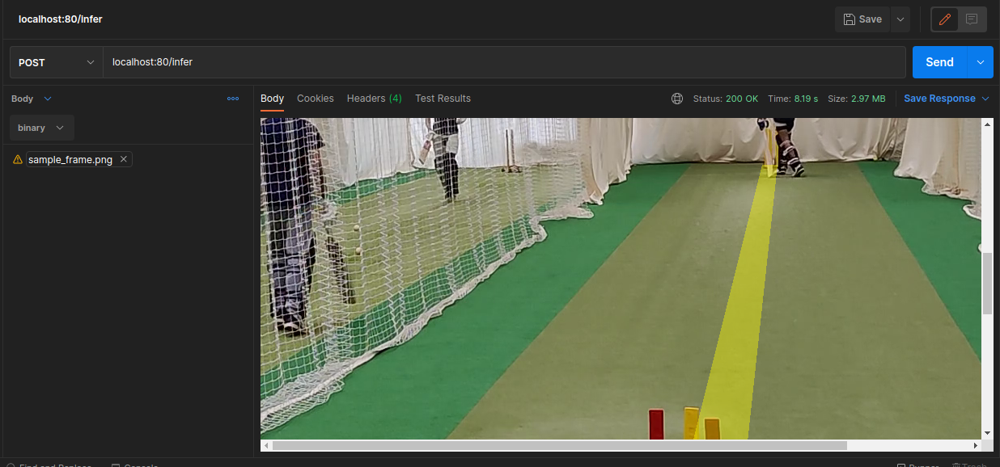
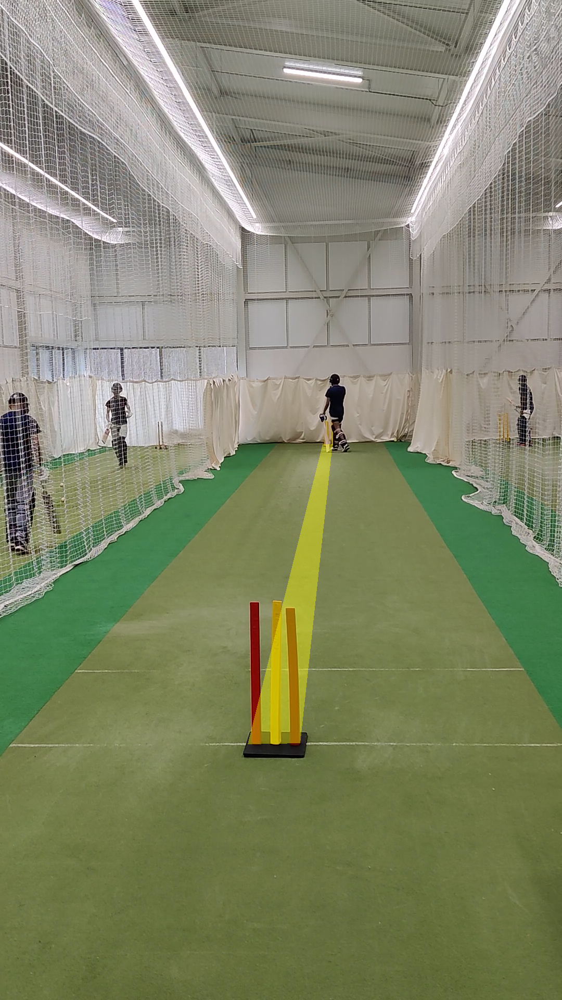

# Stumpline Estimation

### Project Setup:
- Clone this repository.
- Copy and Paste the `detections_sample_video.json` inside the `server` folder.


### Steps taken
- I used a notebook `analyse.ipynb` to analyse the data and annotation provided. Also to come up with possible solution to estimate the stumpline.
  - This notebook requires similar dependencies/packages as mentioned in the `server/requirements.txt`
- After finalising the approach, I developed a containerised FastAPI server which simulates how it would be handled in real world(Obviously simplifyng and assuming few stuffs).


**NOTE: Please go through the python notebook file to understand the approach. The same logic has been containerised as a web server.**

### The Server
- Here is the logic implemented in server:
  1. Read the video from link or file system and performs the detection from all models. **(This is simulated via loading the already provided annotation file).**
  2. Perform stumpline detection.
  3. Draws the stumpline on input sample frame.
- Traverse into `server` folder to build the docker image.
  `docker build -t ludimos:v1 .
  `
- Alternatively you can pull the docker image
  `docker pull amshubh/ludimos:v1
  `
- Run the container using
  `docker run -p 80:80 ludimos:v1
  `
- You should see output like this:
    ```
    INFO:     Started server process [1]
    INFO:     Waiting for application startup.
    INFO:     Application startup complete.
    INFO:     Uvicorn running on http://0.0.0.0:80 (Press CTRL+C to quit)
    ```
- There are two APIs implemented:
  1. `/ping` : To test whether server is running or not. This returns **`PONG`**.
  2. `/infer` : To infer on sample input frame. This API accepts image in binary format in the request body and returns the image with stumpline overlayed on top of it. Please refer to the screenshots attached.
- You can also access `http://localhost/docs` in the browser to get details of APIs.
- For any functionality understanding, please refer to the comments in the code itself.

### Conclusion
This is very basic implementation and there are various scope of improvements, which have been mentioned in the python notebook file as well. In both stumpline detection logic as well as server implementation, it can be optimised even further.

#### Result

